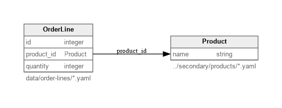

# External Root Path Identifier Example

This example shows a workspace whose main `mergeway.yaml` file lives in `primary/`, while one referenced entity stores its data in the sibling `secondary/` directory and uses `identifier: $path`.

## What it demonstrates
- Entity definitions kept inline in `primary/mergeway.yaml`
- `Product` records loaded from `../secondary/products/*.yaml`
- `$path` identifiers for externally stored records
- An `OrderLine.product_id` reference whose value is the product file path

## Layout
- `examples/external-root-path/primary/mergeway.yaml` defines both entities
- `examples/external-root-path/primary/data/order-lines/*.yaml` contains the `OrderLine` records
- `examples/external-root-path/secondary/products/*.yaml` contains the `Product` records

## Key detail

Because `Product` uses `identifier: $path`, the reference value stored in `OrderLine.product_id` is the normalized relative file path to the product record:

```yaml
product_id: ../secondary/products/widget.yaml
```

## Try It

```bash
mergeway-cli --root examples/external-root-path/primary --format yaml entity show Product
mergeway-cli --root examples/external-root-path/primary get --type OrderLine 1001
mergeway-cli --root examples/external-root-path/primary validate
```

## Diagram

