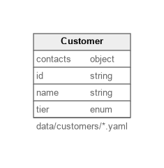

# JSON Schema Example

Demonstrates validating entity records against an external JSON Schema before loading them into Mergeway.

## What it demonstrates
- `json_schema` integration pointing at `schemas/customer.json`
- Required fields, enumerated values, and nested arrays enforced by JSON Schema
- Pulling customer records from YAML files under `data/customers/`

## Diagram

