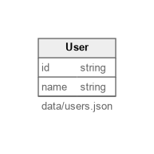

# JSONPath Includes Example

Loads multiple records from a single JSON document by applying a JSONPath selector.

## What it demonstrates
- `include` entry that reads `data/users.json` and selects objects with `$.users[*]`
- Simple `User` entity with a minimal field set and primary key
- Keeping source data in one file while still generating a normalized dataset

## Diagram

