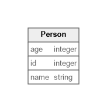

# Simple Example

This example shows the smallest possible Mergeway project: a single `mergeway.yaml` that defines one `Person` entity with inline sample data.

## What it demonstrates
- Minimal configuration: one file with schema, identifier, and data together
- Basic field types (`integer`, `string`) and a single primary key
- Built-in data loading without external includes or schema files

## Diagram

